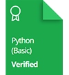

    

# Certifications

<a href="https://www.hackerrank.com/certificates/c1e1ec181200">
    

<a href="https://www.hackerrank.com/certificates/f1f5cc21afdb">
    

# Tests
## Python
1. [Average Function]()
2. [Multiset Implementation]()

## Problem Solving
1. [Unexpected Demand]()
2. [Road Repair]()